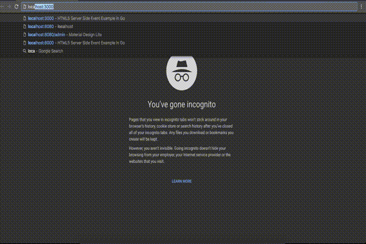

## ping-play
The bigpipe-golang project is a port of [Ping-Play](https://github.com/brikis98/ping-play) to golang and a significant portion of 
Readme is reproduced (mostly the generic concepts).

# bigpipe-golang
The bigpipe-golang project brings [BigPipe](https://www.facebook.com/note.php?note_id=389414033919) streaming to the
[Golang](https://golang.org/). It includes tools for a) splitting your pages up into small "pagelets",
which makes it easier to maintain large websites, and b) streaming those pagelets down to the browser as soon as they
are ready, which can significantly reduce page load time.

To fetch the data for a page, modern apps often have to make requests to multiple remote backend services (e.g. RESTful
HTTP calls to a profile service, a search service, an ads service, etc). You then have to wait for *all* of these
remote calls to come back before you can send *any* data back to the browser. For example, the following screen capture
shows a page that makes 6 remote service calls, most of which complete in few hundred milliseconds, but one takes
over 5 seconds. As a result, the time to first byte is 5 seconds, during which the user sees a completely blank page:


With BigPipe, you can start streaming data back to the browser without waiting for the backends at all, and fill in the
page incrementally as each backend responds. For example, the following screen capture shows the same page making the
same 6 remote service calls, but this time rendered using BigPipe. The header and much of the markup is sent back
instantly, so time to first byte is 10 milliseconds (instead of 5 seconds), static content (i.e. CSS, JS, images) can
start loading right away, and then, as each backend service responds, the corresponding part of the page (i.e. the
pagelet) is sent to the browser and rendered on the screen:



## Quick Start

Implement application:
```golang
// Render generates the basic html markup with containers for individual pagelets.
func (homePageApplication HomePageApplication) Render(w http.ResponseWriter, r *http.Request, pageletFunc func() bool) {
	applicationTemplate, err := template.ParseFiles("templates/homepageapplication.html")
	if err != nil {
		panic(err)
	}
	data := Data{pageletFunc}
	err1 := applicationTemplate.Execute(w, data)
	if err1 != nil {
		http.Error(w, err1.Error(), http.StatusInternalServerError)
	}
}

// PageletsContainerMapping return the list of pagelet in the application with containerId.
func (homePageApplication HomePageApplication) PageletsContainerMapping() map[string]bigpipe.Pagelet {
	return map[string]bigpipe.Pagelet{
		"searchPagelet":         SearchPagelet{},
		"recommendationPagelet": RecommendationPagelet{},
		"profilePagelet":        ProfilePagelet{},
		"adsPagelet":            AdsPagelet{},
	}
}
```

Application is the representation of entire webpage and requires two methods. The method 1 renders the application template and pageletContainerMapping returns the pagelet vs container-id (in dom) mapping.

Implement Pagelet:

```golang
import (
	"bytes"
	"html/template"
	"net/http"
	"time"
)

// ProfilePagelet is 1 more sample service simulation.
type ProfilePagelet struct{}

// Render generates html from template. The html returned is then inserted into container by application.
// Note - Clients are responsible for handling the errors on their own and return the error dom element.
func (profilePagelet ProfilePagelet) Render(r *http.Request) (ret template.HTML) {
	time.Sleep(650 * time.Millisecond)
	buf := bytes.NewBuffer([]byte{})
	templates, err := template.ParseFiles("templates/profilepagelet.gohtml")
	if err != nil {
		return
	}
	templates.Execute(buf, nil)
	ret = template.HTML(buf.String())
	return
}
```
Pagelets requires only 1 method render which returns html.

Render Pagelets in template:

```
<body>

    <table class="wrapper">
        <tr>
            <td id="searchPagelet">
            </td>
            <td id="recommendationPagelet">
            </td>
        </tr>
        <tr>
            <td id="profilePagelet">
            </td>
            <td id="adsPagelet">
            </td>
        </tr>
    </table>
    ....
    {{ if (call .PageletFunc)}}
    {{ end }}
</body>

func (homePageApplication HomePageApplication) Render(..., pageletFunc func() bool) {
	...
	data := Data{pageletFunc}
	err1 := applicationTemplate.Execute(w, data)
	....
}
```
Invoke the pagelet function passed to your application after the complete dom is rendered. Note that this function blocks rendering of further contents. All the pagelets are rendered now and inserted in dom by Javascript. After all the pagelets are rendered pending javascript and body+header end tags are flushed.

## Client-side vs server-side rendering

bigpipe-golang supports both client-side and server-side BigPipe streaming. Client-side streaming sends down the
pagelets in whatever order they complete and uses JavaScript to insert each pagelet into the correct spot in the DOM.
This gives you the fastest possible loading time, but it does add a dependency on JavaScript. 

For use cases where you want to avoid JavaScript, such as slower browsers or search engine crawlers (i.e. SEO), you need to use server-side
rendering, which sends all the pagelets down already rendered as HTML and in the proper order. This will have a longer
page-load time than client-side rendering, but still much faster than not using BigPipe at all. 

## Composing independent pagelets

TODO: write documentation

## De-duping remote service calls

If your page is built out of composable, independent pagelets, then each pagelet will know how to fetch all the data it
needs from backend services. If each pagelet is truly independent, that means you may have duplicated service calls.
For example, several pagelets may make the exact same backend call to fetch the current user's profile. This is
inefficient and increases the load on downstream services. It is currently not supported and tracked [here]
(https://github.com/bangarharshit/bigpipe-golang/issues/3)

## CSS and JS for pagelets

Bigpipe loads CSS for a pagelet before it is rendered. Javascript for a pagelet is loaded after all the pagelets are rendered.
It is currently not supported and tracked [here](https://github.com/bangarharshit/bigpipe-golang/issues/4)

# FAQ

## What are the caveats and drawbacks to BigPipe?

BigPipe is not for everyone. There are some serious drawbacks and caveats you should be aware of before using it:

### HTTP headers and error handling

With BigPipe streaming, you typically start sending the response back to the browser before your backend calls are
finished. The first part of that response is the HTTP headers and once you've sent them back to the browser, it's too
late to change your mind. If one of those backend calls fails, you've already sent your 200 OK, so you can no longer
just send the browser a 500 error or a redirect!

[Pagelets](https://github.com/bangarharshit/bigpipe-golang/blob/master/lib/Pagelet.go) are responsible for handling the error 
and in case of error should render the error template.

### Caching

Because of the the way headers and error handling work, be extra careful using BigPipe if you cache entire
pages, especially at the CDN level. Otherwise, you may stream out a 200 OK to the CDN, hit an error with a backend call,
and accidentally end up caching a page with an error on it.

If your pages are mostly static and can be cached for a long time (e.g. blogs), BigPipe is probably not for you. If
your pages are mostly dynamic and cannot be cached (e.g. the news feeds at Facebook, LinkedIn, Twitter), then BigPipe
can help.

### Pop-in

Pagelets can be sent down to the browser and rendered client-side in any order. Therefore, you have to be careful to
avoid too much "pop-in", where rendering each pagelet causes random parts of the page to pop in and move around, which
makes the page hard to use.

To avoid annoying your users, use CSS to size the placeholder elements appropriately so they don't resize or move much
as the actual content pops in. Alternatively, use JavaScript to ensure that the elements on a page render from top to
bottom, even if they show up in a different order (e.g. set `display: none` until all the pagelets above the current
one have been filled in).

## Why not AJAX?

You could try to accomplish something similar to BigPipe by sending back a page that's empty and makes lots of AJAX
calls to fill in each pagelet. This approach is much slower than BigPipe for a number of reasons:

1. Each AJAX call requires an extra roundtrip to your server, which adds a lot of latency. This latency is especially
   bad on mobile or slower connections.
2. Each extra roundtrip also increases the load on your server. Instead of 1 QPS to load a page, you now have 6 QPS to
   load a page with 6 pagelets.
3. Older browsers severly limit how many AJAX calls you can do and most browsers give AJAX calls a low priority during
   the initial page load.
4. You have to download, parse, and execute a bunch of JavaScript code before you can even make the AJAX calls.
5. It only works with JavaScript enabled.

BigPipe gives you all the benefits of an AJAX portal, but without the downsides, by using a single connection&mdash;that
is, the original connection used to request the page&mdash;and streaming down each pagelet using
[HTTP Chunked Encoding](https://en.wikipedia.org/wiki/Chunked_transfer_encoding), which works in almost all browsers.

## Where can I find more info?

1. [Composable and Streamable Play Apps](https://engineering.linkedin.com/play/composable-and-streamable-play-apps):
   a talk that introduces how BigPipe streaming works on top of Play (see the
   [video](https://www.youtube.com/watch?v=4b1XLka0UIw) and
   [slides](http://www.slideshare.net/brikis98/composable-and-streamable-play-apps)).
2. [BigPipe: Pipelining web pages for high performance](https://www.facebook.com/note.php?note_id=389414033919): the
   original blog post by Facebook that introduces BigPipe on PHP.
3. [New technologies for the new LinkedIn home page](http://engineering.linkedin.com/frontend/new-technologies-new-linkedin-home-page):
   the new LinkedIn homepage is using BigPipe style streaming with Play. This ping-play project is loosely based off of
   the work done originally at LinkedIn.

# Project info

## Status


